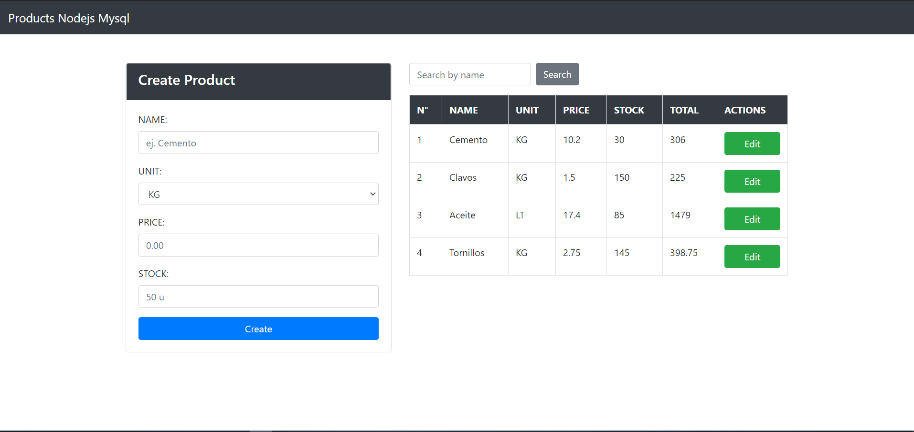

## Materials Registration System made it with Nodejs, Express and MySQL 👍👍

#### 📖Features:

    ▶️ Server Development with Nodejs and Express
    ▶️ MySQL Database Connection
    ▶️ Show Products View
    ▶️ Create Product
    ▶️ Delete Product if the stock is 0 only
    ▶️ Update Products
    ▶️ Search Products by name

#### 🧰Tools and Languages:

    ▶️ NodeJS
    ▶️ ExpressJS
    ▶️ MySQL
    ▶️ NPM
    ▶️ EJS Templates
    ▶️ VSCode

**Screenshot**


**Remember install npm packages**

```
git clone https://github.com/TonyGLL/project-products-nodejs-mysql.git
```

```
cd project-products-nodejs-mysql
```

```
npm install
```

```
npm run dev or npm run start
```

**Remember to change the data of the connection configuration in the app.js file**

```javascript
app.use(
  myConnection(
    mysql,
    {
      host: "xxxx",
      user: "xxxx",
      password: "xxxx",
      port: xxxx,
      database: "project_nodejs_mysql",
    },
    "single"
  )
);
```
